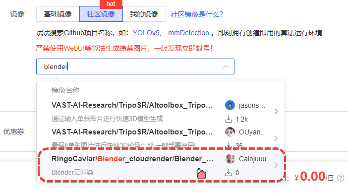

# Blender_cloudrender

## 作用

在AutoDL等服务器上快捷部署Blender进行渲染

## 什么人需要它？

- 当你需要使用Blender渲染一帧超高质量的图片，渲染时间大概要几个小时甚至十几个小时。

- 当你需要渲染一段动画，本地渲染速度无法满足需求并且其他渲染平台价格较高时。

## 如何使用它？

下载<mark>一键部署Blender.ipynb</mark>文件上传到新建好的服务器中，双击打开按照提示依次运行命令即可

## AutoDL服务器创建指南：

1. 推荐选择西北地区或者重庆地区的4090D 24G，数据盘50G一般够用，不够可以扩容。价格一般是2块钱一小时，按量计费。

2. 镜像选择：使用社区镜像，搜索blender，选择该镜像。创建服务器即可，启动服务器后可以直接开始上传你的Blender工程到autodl-tmp文件夹下的render_files文件夹中，上传的路径没有强制要求。
   
   

3. 使用镜像创建的服务器无需进行环境配置，直接运行渲染指令即可，运行前一定要更改渲染命令，关于渲染命令的含义可以查询Blender官方手册的[命令行渲染部分]([命令行参数 - Blender 4.2 Manual](https://docs.blender.org/manual/zh-hans/4.2/advanced/command_line/arguments.html#command-line-arguments))。

###### 此脚本仅有<u>辅助作用</u>，linux基础命令需要掌握一些，比如cd命令。blender命令行渲染的相关参数在[官方手册]([命令行参数 - Blender 4.2 Manual](https://docs.blender.org/manual/zh-hans/4.2/advanced/command_line/arguments.html#command-line-arguments))中查询。
